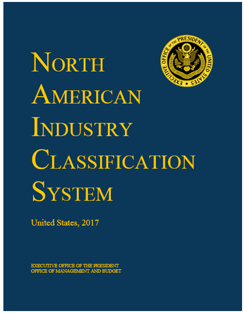
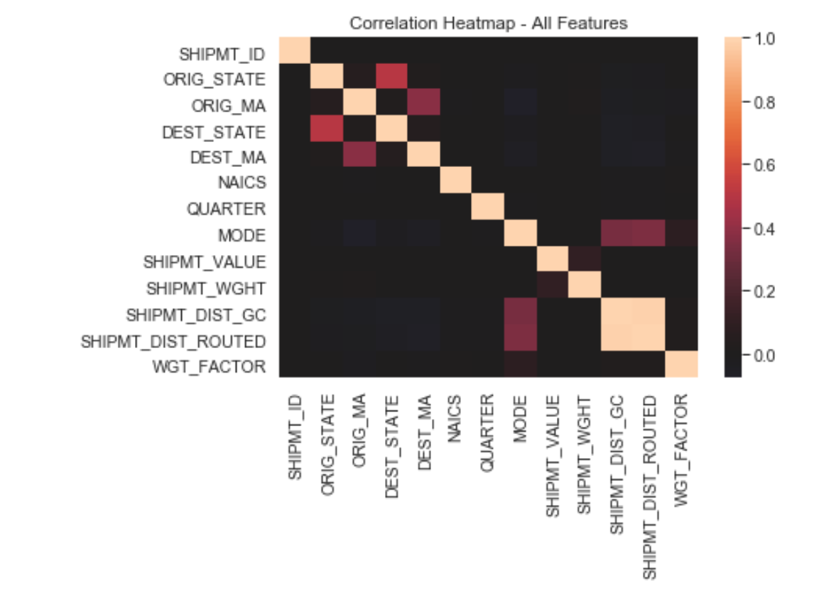
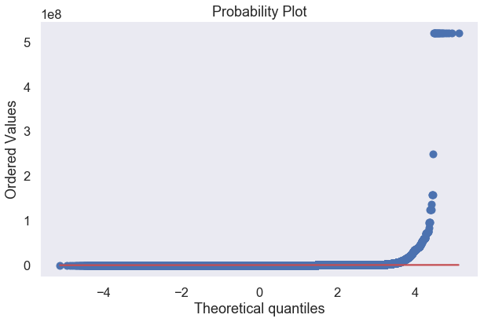
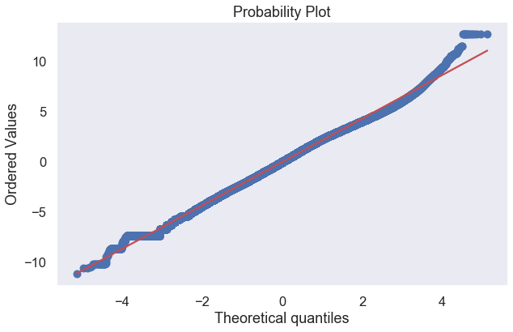
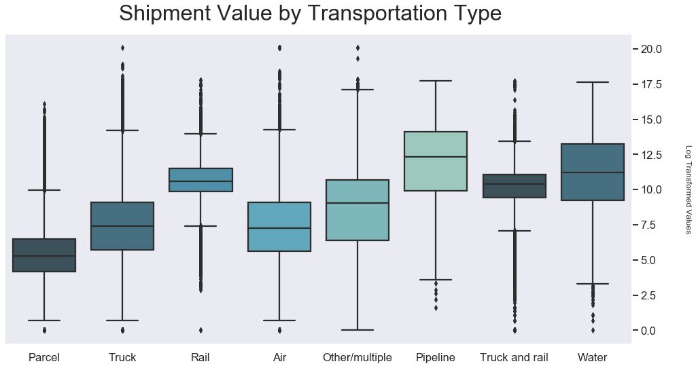
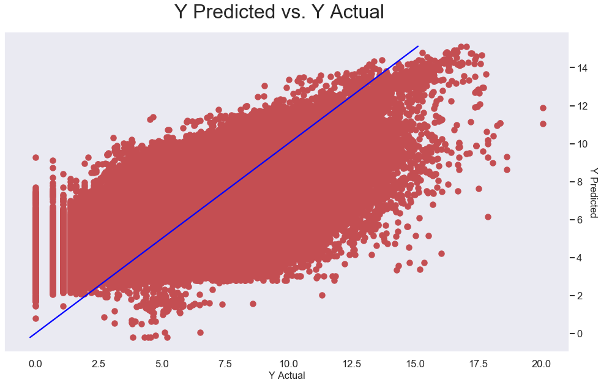
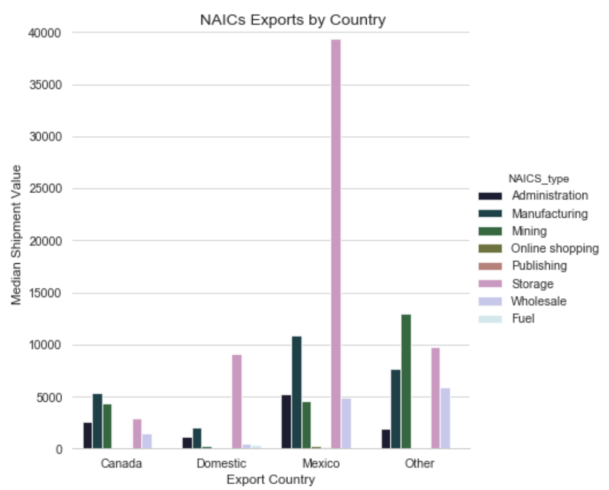

# Commodity Flow Survey Regression Analysis

## Contributors 
Michael Eby

Melissa Munz

## Summary 

The goal for this project was to predict a shipment value based on the U.S. Census Bureau's 2012 Commodity Flow Survey.

Based on our analysis, we produced a linear regression model that predicted a shipment's value in U.S. dollars with an R2 of 0.649.

## Commodity Flow Survey

Our dataset for this project was the 2012 Commodity Flow Survey. Released by the U.S. Census Bureau every 5 years, the CFS data is used by policy makers and transportation planners in various federal, state, and local agencies for assessing the demand for transportation facilities and services, energy use, and safety risk and environmental concerns. The report is released every 5 years (2012 most recent completed survey), and includes 4.5 million individual shipments with 20 features each. More information on the dataset can be found here: [bts.gov/cfs](https://www.bts.gov/cfs). 

## Features

Shipments in the survey each included 20 features each. We chose to focus on the features that we intuitively assumed were the most imporant for predicting a shipment's total value in USD:

- NAICS (North American Industry Classification System) code
- Mode of transportation
- Distance routed in miles
- Shipment weight in USD
- Yearly quarter
- Origin state 
- Destination state

There were almost no correlated features in our dataset.

## Feature Engineering

In order to make the NAICS codes and transportation mode variables manageable, we binned them into smaller subgroups:

1. NAICS Codes (North American Industry Classification System) were originally classified into 46 different codes. We filtered these into 8 subgroups: Mining, Manufacturing, Wholesale, Online shopping, Fuel, Storage, Publishing, Administration

2. Transportation Mode filtered from 20 types into 8 subgroups: Parcel, Pipeline, Air, Water, Truck, Rail, Truck and rail, Other/multiple

## Scaling Continous Variables

Significant variation between mean shipment values of the NAICS codes and transportation types as well as abnormally distributed data and varying scales for continuous independent variables meant that values needed to be scaled for the model. The first variable scaled was the dependent variable, shipment value, as the error was not normally distributed around the mean:

Log-transforming the shipment value significantly improved this.

However, our model was still not performing well with our two continuous variables, shipment weight and distance travelled. 
Both min-max scaling and standard scaling failed to improve model performance. Instead, log transformation of these variables yielded higher performance. It also made it easier to visualize the differences between the average shipment values of the different the NAICS codes and transportation modes:

## Final Model

Lasso and ridge regression were discarded in favor of an Ordinary Least Squares regression model. Other models such as ANOVA, polynomial regression, and interactions were also tried, but these failed to yield the quality of the results obtained through OLS.

- R2 = 0.694 
- Train Mean Squared Error: 1.984468
- Test Mean Squared Error: 1.990008

Coefficients for discrete and continuous independent variables can be found in the notebook.

## Implications

- Storage related exports  have  higher total shipment value
- Commodities shipped by pipeline or by water have higher total shipment value

## Further Research

Further areas of study include time-series analysis to see how shipment value is affected by the variables over the years, especially as compared to 2017 data.
